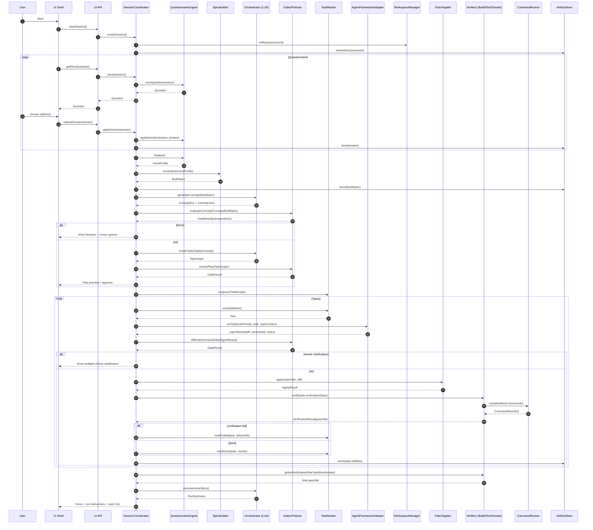
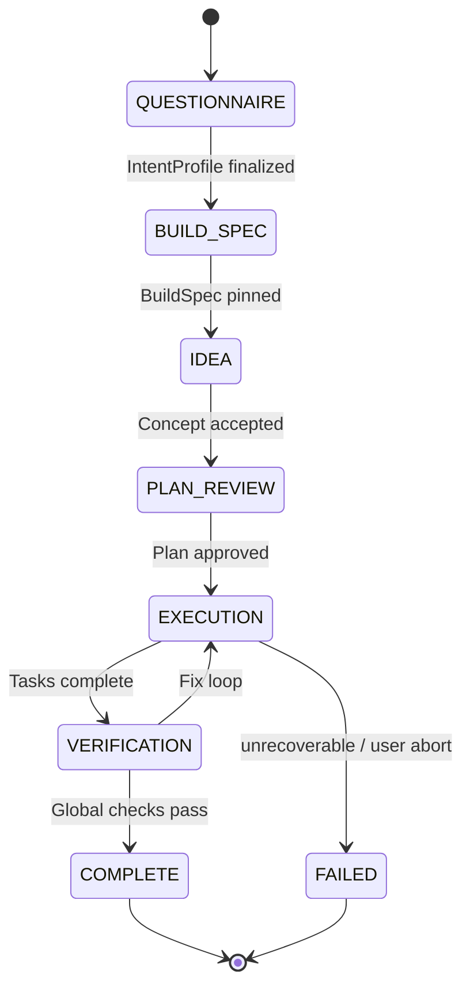

# Diagrams

# VibeForge — Architecture diagrams & MVP workflow pseudocode

This document visualizes the proposed “cloud-first MVP, local later” architecture and provides pseudocode for each stage of the workflow.

---

## 1) Container-level diagram (C4-style)

```mermaid
flowchart LR
  U[User] --> UI[UI Shell<br/>(Web/Electron/TUI)]
  UI --> API[Local UI API<br/>(UiApiController)]

  API --> COORD[Session Coordinator<br/>(State machine)]
  COORD --> QE[Questionnaire Engine]
  COORD --> SB[Spec Builder<br/>(deterministic)]
  COORD --> ORCH[Orchestrator<br/>(LLM-driven reasoning)]
  COORD --> GATES[Gates & Policies<br/>(feasibility/risk/diff/command)]
  COORD --> TM[Task Master<br/>(scheduler)]
  TM --> DIST[Distributor<br/>(role routing)]
  DIST --> AF[Agent Framework Adapter<br/>(pluggable)]
  AF --> LLM[Model Router + Providers<br/>(OpenAI now, Local later)]
  AF --> WS[Workspace Manager<br/>(repo/artifacts)]
  AF --> PA[Patch Applier<br/>(unified diff)]
  COORD --> VR[Verification Runtime<br/>(build/test/smoke)]
  VR --> CR[Command Runner<br/>(allowlisted)]
  COORD --> AS[Artifact Store + Event Log]

  WS <--> AS
  PA --> WS
  CR --> WS

  subgraph Models
    LLM --> OPENAI[OpenAI Provider<br/>(MVP)]
    LLM --> LOCAL[Local Provider<br/>(later)]
  end
```

---

## 2) Core component diagram (inside “Factory Brain”)

```mermaid
flowchart TB
  COORD[SessionCoordinator] --> SESS[Session Store (in-memory)]
  COORD --> QE[QuestionnaireEngine]
  COORD --> SB[SpecBuilder]
  COORD --> ORCH[Orchestrator]
  COORD --> TG[TaskGraph Manager]
  COORD --> TM[TaskMaster]
  COORD --> G[Gates/Policies]
  COORD --> PA[PatchApplier]
  COORD --> VR[VerifierSuite]
  COORD --> AR[AppRunner]
  COORD --> AS[ArtifactStore/EventLog]

  ORCH --> MR[ModelRouter]
  MR --> LLM[LlmClient]
  LLM --> OPENAI[OpenAiProvider]
  LLM --> LOCAL[LocalProvider (later)]

  TM --> DIST[Distributor]
  DIST --> AF[AgentFramework Adapter]
  AF --> ORCH2[Role Prompting + Tool Policy]
  ORCH2 --> LLM
```

---

## 3) Sequence diagram — Happy path + verification gates



---

## 4) State machine — MVP phases



---

# 5) Project structure (recommended)

```text
vibeforge/
  apps/
    ui/                         # simple UI (web/electron/tui)
    api/                        # local UI API (REST/WebSocket)
  core/
    session/                    # Session + state machine
    questionnaire/              # QuestionnaireEngine + question banks
    spec/                       # SpecBuilder + deterministic seed/twists
    orchestrator/               # Orchestrator (plans, concept, summary)
    gates/                      # Policy gates (risk, feasibility, diff, commands)
  orchestration/
    taskgraph/                  # TaskGraph types, validation, utilities
    taskmaster/                 # scheduling + dependency resolution
    distributor/                # role routing + dispatch policy
    agent_framework/            # adapter interface + implementations
  models/
    llm_client/                 # LlmClient interface
    providers/                  # OpenAI provider now; Local provider later
    router/                     # model selection policy
    prompts/                    # role prompts + templates
    parsing/                    # OutputValidator/Repair (JSON schemas)
  runtime/
    workspace/                  # WorkspaceManager, repo init, snapshots
    patching/                   # PatchApplier, diff tools
    commands/                   # CommandRunner + allowlist enforcement
    verification/               # Build/Test/Smoke verifiers
    apprunner/                  # start/stop + run instructions
  storage/
    artifacts/                  # ArtifactStore (JSON/files)
    eventlog/                   # append-only event log
  schemas/                      # JSON schemas (IntentProfile, BuildSpec, etc.)
  configs/
    stacks/                     # allowlisted stack presets
    policies/                   # forbidden patterns, command families
  workspaces/                   # generated runs live here (gitignored)
  docs/                         # architecture docs
  tests/                        # unit/integration tests for factory
```

---

# 6) MVP workflow pseudocode (per stage)

## Stage 0 — Start session

```pseudo
function startSession():
  session = Session.create()
  ArtifactStore.init(session.id)
  repoPath = WorkspaceManager.initRepo(session.id, template=StackPreset.baseTemplate)
  session.phase = QUESTIONNAIRE
  return session.id
```

---

## Stage 1 — Questionnaire (no free text)

```pseudo
function getNextQuestion(sessionId):
  session = SessionStore.get(sessionId)
  assert session.phase == QUESTIONNAIRE
  return QuestionnaireEngine.nextQuestion(session)

function submitAnswer(sessionId, answer):
  session = SessionStore.get(sessionId)
  QuestionnaireEngine.applyAnswer(session, answer)
  ArtifactStore.put(sessionId, "answers/...", answer)

  if QuestionnaireEngine.isComplete(session):
    intent = QuestionnaireEngine.finalize(session)
    session.intentProfile = intent
    ArtifactStore.put(sessionId, "intent_profile.json", intent)
    session.phase = BUILD_SPEC
```

---

## Stage 2 — Deterministic BuildSpec (plus controlled randomness)

```pseudo
function buildSpec(sessionId):
  session = SessionStore.get(sessionId)
  assert session.phase == BUILD_SPEC

  buildSpec = SpecBuilder.fromIntent(session.intentProfile)

  # Controlled randomness is deterministic & replayable
  seed = DeterministicSeed.derive(session.intentProfile)
  ideaSeed = IdeaSeedPicker.pick(seed, buildSpec.allowedGenres, buildSpec.allowedTwists)
  buildSpec.ideaSeed = ideaSeed

  GateResults.requireOk(FeasibilityGate.evaluate(buildSpec))
  ArtifactStore.put(sessionId, "buildspec.json", buildSpec)

  session.buildSpec = buildSpec
  session.phase = IDEA
```

---

## Stage 3 — Orchestrator generates concept

```pseudo
function generateConcept(sessionId):
  session = SessionStore.get(sessionId)
  assert session.phase == IDEA

  modelRef = ModelRouter.chooseModel(role="orchestrator", complexity="medium", failures=0)
  concept = Orchestrator.generateConcept(session.buildSpec, modelRef)

  conceptJson = OutputValidator.validate(schema=ConceptSchema, text=concept.json)
  conceptDoc  = concept.markdown

  gate = PolicyGate.evaluate(conceptJson, session.buildSpec)
  if not gate.ok:
    # Either auto-revise or ask UI to choose from constrained revisions
    return {status:"needs_clarification", questions: gate.clarifyingQuestions}

  ArtifactStore.put(sessionId, "concept.json", conceptJson)
  ArtifactStore.put(sessionId, "concept.md", conceptDoc)

  session.conceptDoc = conceptDoc
  session.phase = PLAN_REVIEW
```

---

## Stage 4 — TaskGraph + plan review

```pseudo
function proposePlan(sessionId):
  session = SessionStore.get(sessionId)
  assert session.phase == PLAN_REVIEW

  taskGraph = Orchestrator.createTaskGraph(session.buildSpec, session.conceptDoc)

  taskGraph = OutputValidator.validate(schema=TaskGraphSchema, text=taskGraph.json)

  gate1 = RiskGate.evaluate(taskGraph, policies=BuildSpec.policies)
  gate2 = FeasibilityGate.evaluate(taskGraph, budget=BuildSpec.scopeBudget)

  if not (gate1.ok and gate2.ok):
    return {status:"needs_clarification", questions: merge(gate1.questions, gate2.questions)}

  ArtifactStore.put(sessionId, "taskgraph.json", taskGraph)
  return {status:"awaiting_user_approval", planSummary: summarize(taskGraph)}
```

```pseudo
function approvePlan(sessionId, decision):
  if decision != "approve": abortOrRevise()
  session = SessionStore.get(sessionId)
  TaskMaster.enqueue(sessionId, session.taskGraph)
  session.phase = EXECUTION
```

---

## Stage 5 — Execution loop (sequential MVP)

```pseudo
function executeNext(sessionId):
  session = SessionStore.get(sessionId)
  assert session.phase == EXECUTION

  task = TaskMaster.scheduleNext(sessionId)
  if task == null:
    session.phase = VERIFICATION
    return

  role = Distributor.route(task)   # scaffold/ui/logic/tests/fixer/reviewer

  ctx = RepoContextLoader.selectFiles(repoPath, task.inputs.filesToRead, maxBytes=BuildSpec.contextBudget)

  agentProfile = AgentRegistry.get(role)
  modelRef = ModelRouter.chooseModel(role=role, complexity=task.complexityHint, failures=task.failureCount)

  agentResult = AgentFramework.runTask(agentProfile, task, ctx, modelRef)

  # Validate result shape
  parsed = OutputValidator.validate(schema=AgentResultSchema, text=agentResult.json)

  # Gate: commands allowlist + diff safety (file count, line limits, forbidden patterns)
  gate = DiffAndCommandGate.evaluate(parsed, buildSpec.policies, task.constraints)
  if not gate.ok:
    TaskMaster.markFailed(task.id, gate.blockers)
    return

  if parsed.status == "needs_clarification":
    return {status:"needs_clarification", questions: parsed.questions}

  apply = PatchApplier.apply(repoPath, parsed.diff)
  if not apply.ok:
    TaskMaster.markFailed(task.id, apply.error)
    # optionally auto-route to FIXER role immediately
    return

  # Verification steps after task
  verification = VerifierSuite.verify(repoPath, task.verificationSteps)
  if not verification.ok:
    TaskMaster.markFailed(task.id, verification.failures)
    # schedule fixer task or retry policy
  else:
    TaskMaster.markDone(task.id, verification.summary)

  ArtifactStore.put(sessionId, f"tasks/{task.id}/result.json", parsed)
  ArtifactStore.put(sessionId, f"tasks/{task.id}/verification.json", verification)
```

---

## Stage 6 — Global verification + run instructions

```pseudo
function finalize(sessionId):
  session = SessionStore.get(sessionId)
  assert session.phase == VERIFICATION

  global = VerifierSuite.verify(repoPath, TaskGraph.globalVerification)
  if not global.ok:
    # schedule fixer tasks, or ask user to reduce scope
    session.phase = EXECUTION
    return {status:"needs_fixing", failures: global.failures}

  runInfo = AppRunner.getRunInstructions(repoPath)
  summary = Orchestrator.summarize(ArtifactStore.collectRunArtifacts(sessionId))

  ArtifactStore.put(sessionId, "run_instructions.md", runInfo)
  ArtifactStore.put(sessionId, "summary.md", summary)

  session.phase = COMPLETE
  return {status:"complete", runInfo, summary}
```

---

# 7) Notes on “cloud-first now, local later”

- **MVP**: `OpenAiProvider` implements `LlmClient`. All roles (orchestrator/worker/fixer/reviewer) can use OpenAI via role prompts.
- **Later**: add `LocalProvider` (Ollama/llama.cpp/vLLM). No pipeline changes, only provider swap/routing.
- Keep model selection and prompts in `models/router` + `models/prompts`, and keep the executor logic model-agnostic.

---

